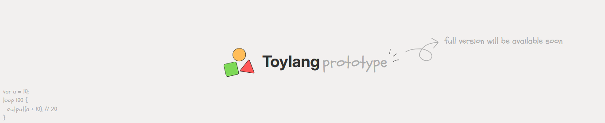

<center>

</center>

# ToyLang 


A simple, readable, dynamically typed programming language.

> [!NOTE]
> Currently implemented as a tree-walking interpreter written in **Rust**. A future rewrite in **C with bytecode compilation** is planned for better performance.

---

## Features

- Clean, beginner-friendly syntax (Python meets JavaScript)
- Dynamic typing with explicit type conversion
- Functions, classes, and inheritance
- Arrays and hashmaps
- Built-in I/O functions
- `loop` keyword unifying counted and conditional loops

---

## Syntax Overview

### Variables

```
var name = "ToyLang";
var age = 18;
```

Variable shadowing is allowed (re-declaring a variable in the same scope overwrites it).

> [!WARNING]
> Variable shadowing will be **removed** in the future updates.

### Comments

```
// this is a single line comment
/* 
    this is a multi line comment.
*/
```

### Built-in Functions

| Function         | Description                        |
|------------------|------------------------------------|
| `output(value)`  | Print a value to the console       |
| `input(prompt)`  | Read a line of input from the user |
| `number(value)`  | Convert a value to a number        |
| `string(value)`  | Convert a value to a string        |
| `boolean(value)` | Convert a value to a boolean       |
| `type(value)`    | Extract type of a value            |

### Functions

```
func greet(name) {
    output("Hai, " + name);
}

func add(a, b) {
    return a + b;
}
```

### Control Flow

```
if i < 10 {
    
} else if i < 20 {
    
} else {
    
}
```

### Loops

ToyLang uses a single `loop` keyword for both counted and conditional loops:

```
// Executes exactly 6 times
loop 6 {
    // ...
}

// Loops if the condition is true
loop if i > 10 {
    // ...
}

// Loop through array
loop i in [10, 9, 8, 7, 6] {
    // ...
}
```

### Classes & Inheritance

```
class Person {
    func Person(name, age) {
        this.name = name;
        this.age = age;
    }

    func display() {
        output("Name: " + this.name + "\n");
        output("Age: " + this.age + "\n");
    }
}

var person1 = Person("Spongebob", 79);
person1.display();
```

Inheritance uses the `inherit` keyword. Use `super` to refer to the parent class:

```
class Student inherit Person {
    func Student(name, age, marks) {
        super(name, age);
        this.marks = marks;
    }

    func display() {
        output("Name: " + this.name + "\n");
        output("Age: " + this.age + "\n");
        output("Marks: " + this.marks + "\n");
    }
}

var student1 = Student("Spongebob", 79, 99.98);
student1.display();
```

### Arrays

```
var array = [1, 2, 3, 4, 5];
```

### Hashmaps

```
var hashmap = {
    name: "Spongebob",
    age: 79,
};
```

### Null

```
var nothing = null;
```

---

## Types

ToyLang is **dynamically typed**. The following types are supported:

- `number` — floating point numbers
- `string` — text values
- `boolean` — `true` or `false`
- `null` — absence of a value

Use the built-in conversion functions (`number()`, `string()`, `boolean()`) to explicitly convert between types.

---

## Example Program

```
// Greet the user
func greet(name) {
    output("Hai, " + name);
}

var name = input("Enter your name: ");
var age = number(input("Enter your age: "));
greet(name);

// Class example
class Person {
    func Person() {
        this.name = "unknown";
    }
    func introduce() {
        output(this.name);
    }
}

var p = Person();
p.introduce();
```

---

## Project Status

This is a **prototype** project. The current Rust implementation is a working tree-walking interpreter.

### Planned: C Rewrite with Bytecode VM

The next major milestone is a rewrite in C with a bytecode compiler and stack-based virtual machine, similar to how Lua and CPython work. This will involve:

1. **Lexer** — tokenizer
2. **Parser** — builds an AST
3. **Compiler** — walks the AST and emits bytecode
4. **VM** — a stack-based loop that executes bytecode instructions
5. **Value system** — tagged union to represent ToyLang values in C

This rewrite will significantly improve performance.

### Planned Language Features

- String interpolation: `"Hello, {name}"`
- Improved error messages

---

## Inspiration

- Syntax inspired by Python, JavaScript, and Rust